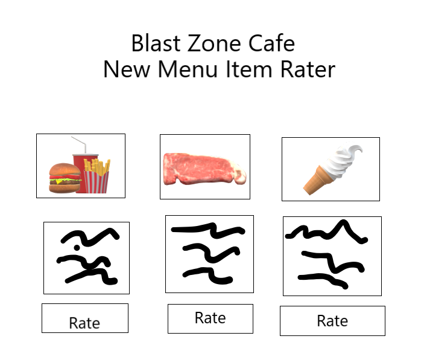

# startup

### Elevator pitch

My restaurant, The Blast Zone Cafe, a futuristic-themed restaurant known for creative food that explodes with flavor (not literally, of course), will increase business by making customers excited to participate in deciding what new, innovative food items will be added to the menu. During the promotion, users will get to choose three new menu items from the descriptions on the restaurant’s website that they would like to see added to the regular menu. During the promotion period, the current voting statistics for each potential new menu item will be displayed. At the end of the promotion, the top three menu items with the most votes will be added to The Blast Zone Cafe menu.

### Design

### Key features

- Secure login over HTTPS
- Ability to select a list of potential menu items
- Display of choices
- Top-Three Voting System

### Technologies

I am going to use the required technologies in the following ways.

- **HTML** - Uses correct HTML structure for application. Two HTML pages. One for login and one for voting. Hyperlinks to choice artifact.
- **CSS** - Application styling that looks good on different screen sizes, uses good whitespace, color choice and contrast.
- **JavaScript** - Provides login, choice display, applying votes, display other users votes, backend endpoint calls.
- **Service** - Backend service with endpoints for:
  - login
  - retrieving choices
  - submitting votes
  - retrieving vote status
- **DB/Login** - Store restaurant owners live info
- **WebSocket** - As each user votes, update the votes live.
- **React** - Application ported to use the React web framework.

### Update Log: HTML Deliverable:

- HTML pages - Two HTML page that represent the ability to login and vote on the menu designs.
- Links - The login page automatically links to the ranking page and vice versa.
- Text - Each of the menu items has a text description. Currently they are placeholders
- Images - I included the images for the possible menu items
- DB/Login - Input box and submit button for login. The voting choices represent data pulled from the database.
- WebSocket - The count of menu rating results represent the tally of realtime votes.

### Update Log: CSS Deliverable:

- Header, footer, and main content body - Properly styled these components
- Navigation elements - The login page automatically links to the ranking page and vice versa. The link is now also properly styled as well.
- Responsive to window resizing - The login page login is centered regardless of page size. The header and footer of the main page vanish when the page is shrunk to a certain size
- Application elements - I made sure the images were the right size, and that everything looked neat. I also added color and a border around the table.
- Application text content - The text of the pages are now properly stylized
- Application images - The three images are set to a certain and consistient size.

### Update Log: JS Deliverable:

- Added JavaScript support for future login: Added username and login with username being displayed on main page.
- Added JavaScript support for future database data: added way to store ratings and calcuate and display the average.
- Added JavaScript support for future WebSocket: added support for a chat box with a notifcation system that reports when someone submits a rating.
- Added JavaScript support for your application's interaction logic: All of the above, plus navigation between pages.

### Update Log: Service Deliverable:

- Created an HTTP service using Node.js and Express
- Added: Frontend served up using Express static middleware
- My frontend calls third party service endpoints: Added random dad joke when page is loaded.
- My frontend and backend provides service endpoints. Endpoints are /api, /login, /user

### Update Log: Login Deliverable:

- Supports new user registration
- Supports existing user authentication
- Stores application data in MongoDB
- Stores and retrieves credentials in MongoDB
- Restricts application functionality based upon authentication

### Update Log: Websocket Deliverable:

Backend listens for WebSocket connection
Frontend makes WebSocket connection
Data sent over WebSocket connection
WebSocket data displayed in the application interface - displays whenever a user makes a rating.
